# Librarian

A library management system made with Flutter and Firebase(Auth and Firestore)

Screenshots below ran on the Nexus 6 virtual device, not yet tested on an iOS device

<h2>Startup Screen</h2>

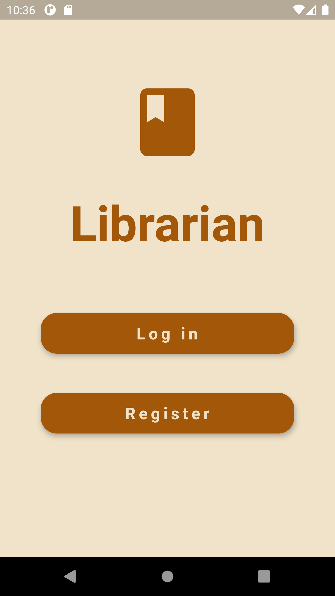
 
<h2>Login Screen</h2>

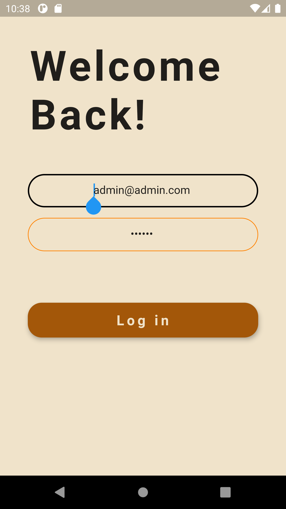
 
<h2>Register Screen</h2>

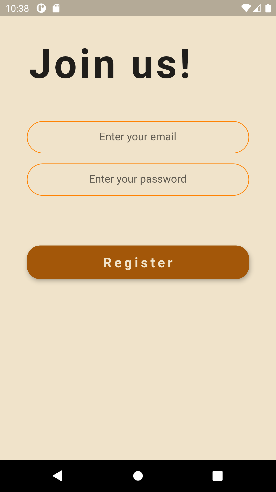
 
<h2>Authentication error handling</h2>

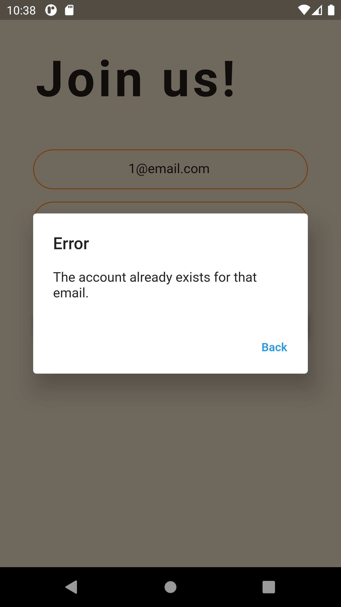
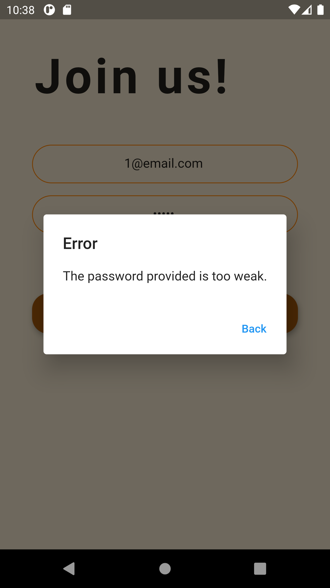
<h2>Admin features</h2>

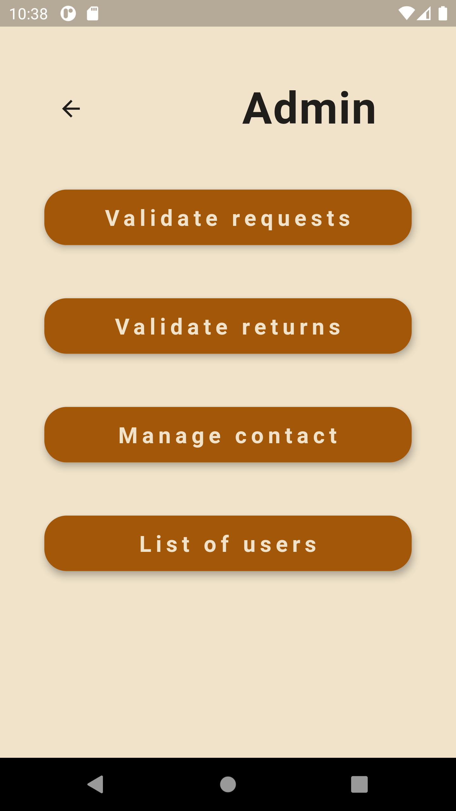
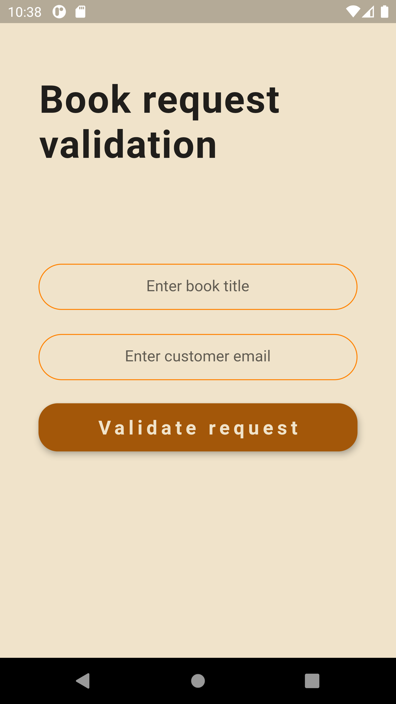
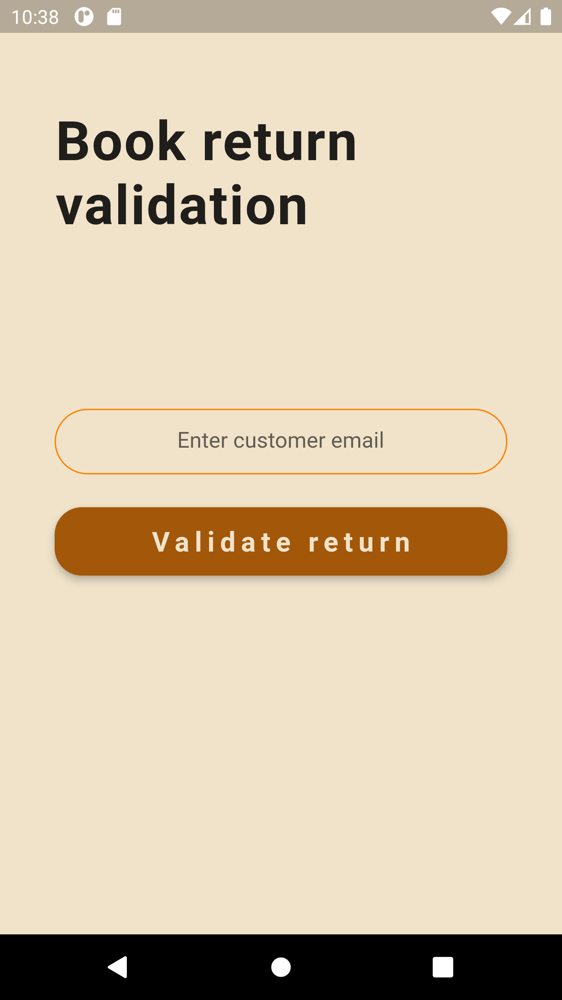
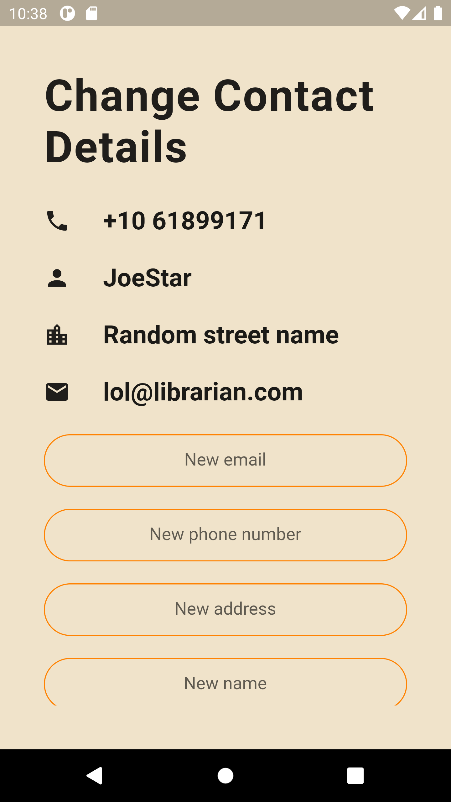
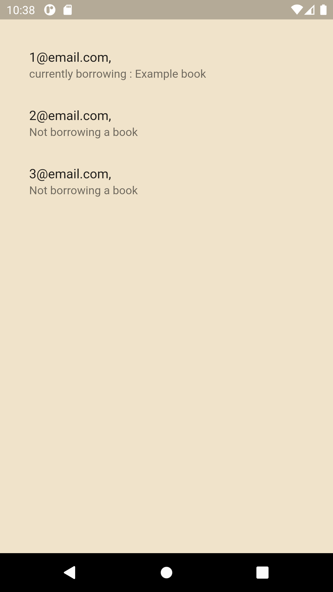
<h2>User features</h2>

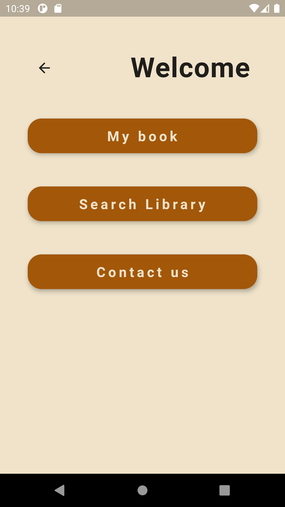
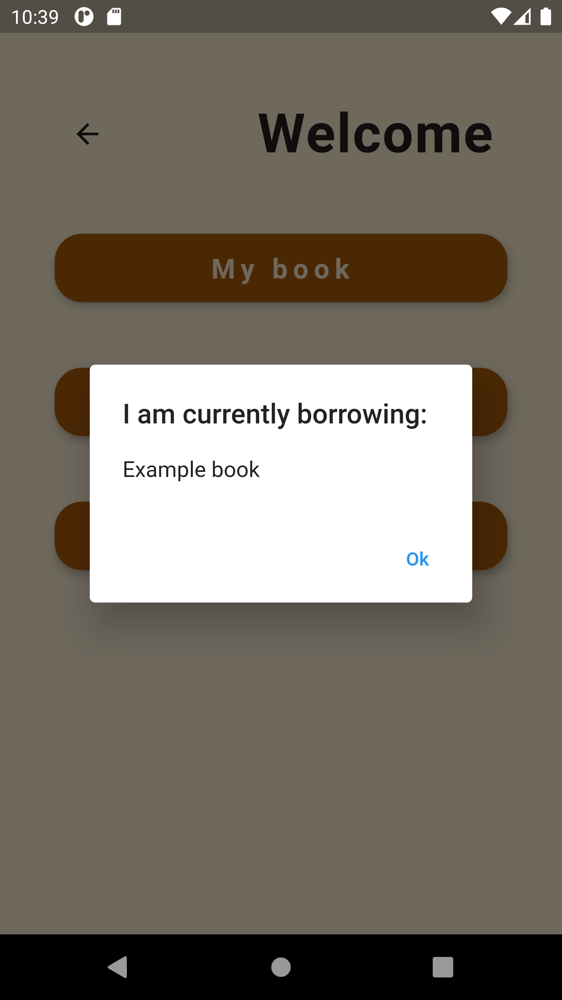
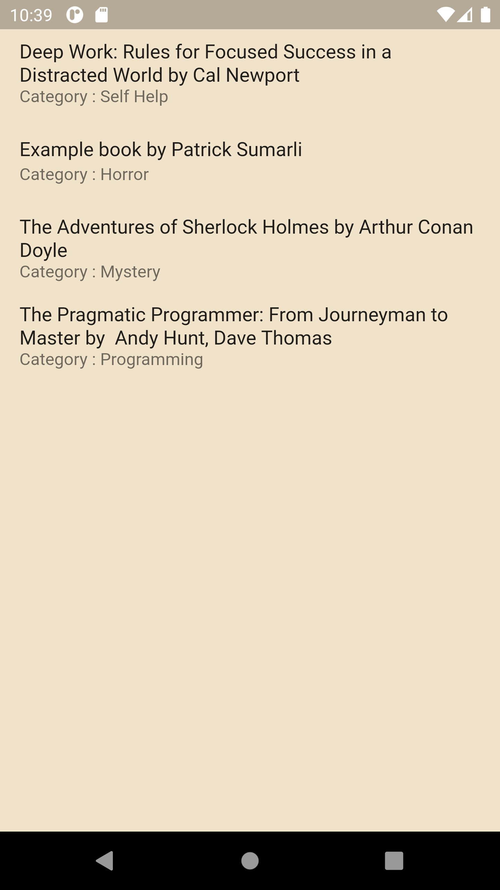
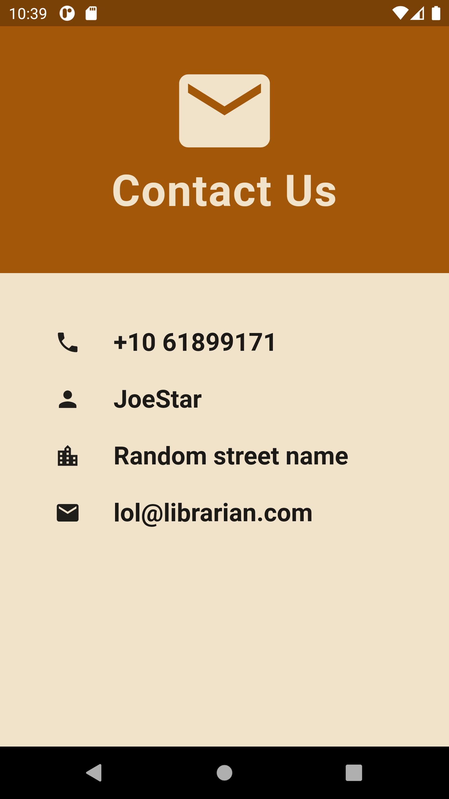
